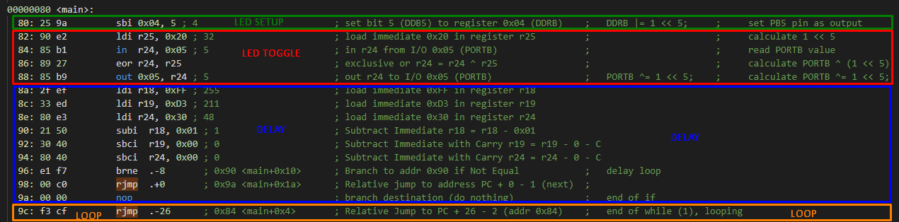

# ATmega328p - simple led blink

See : https://gitlab.adecy.fr/embedded/atmega328p/getting-start

Disassembly function : `avr-objdump -d .pio/build/pro16MHzatmega328/firmware.elf > disassembly.s`

Analysis disassembly : [disassembly.s](disassembly.s)

## Instructions:

32 registres : r0 -> r31

## Analysis



### LED
```asm
  80:	25 9a       	sbi	0x04, 5	; 4							; set bit 5 (DDB5) to register 0x04 (DDRB)    ;   DDRB |= 1 << 5;     ;     set PB5 pin as output
  82:	90 e2       	ldi	r25, 0x20	; 32					; load immediate 0x20 in register r25         ;                       ;     calculate 1 << 5
  84:	85 b1       	in	r24, 0x05	; 5						; in r24 from I/O 0x05 (PORTB)                ;                       ;     read PORTB value
  86:	89 27       	eor	r24, r25 							; exclusive or r24 = r24 ^ r25                ;                       ;     calculate PORTB ^ (1 << 5)
  88:	85 b9       	out	0x05, r24	; 5						; out r24 to I/O 0x05 (PORTB)                 ;   PORTB ^= 1 << 5;    ;     calculate PORTB ^= 1 << 5;
```

### delay ms

The assembly code following seems to do the delay function.

```asm
  8a:	2f ef       	ldi	r18, 0xFF	; 255						; load immediate 0xFF in register r18
  8c:	33 ed       	ldi	r19, 0xD3	; 211 						; load immediate 0xD3 in register r19
  8e:	80 e3       	ldi	r24, 0x30	; 48 						; load immediate 0x30 in register r24
  90:	21 50       	subi	r18, 0x01	; 1						; Subtract Immediate r18 = r18 - 0x01
  92:	30 40       	sbci	r19, 0x00	; 0						; Subtract Immediate with Carry r19 = r19 - 0 - C
  94:	80 40       	sbci	r24, 0x00	; 0						; Subtract Immediate with Carry r24 = r24 - 0 - C
  96:	e1 f7       	brne	.-8      	; 0x90 <main+0x10> 		; Branch to addr 0x90 if Not Equal            ;   delay loop
```

It is a 24 bit decrementer.

Start at `clocks = 30 D3 FF (16) = 3199999 (10)`

`subi`, `sbci` and `brne` is 2 a(expect `brne` for last which is 1)

So all the loop from addr `90` to `96` is 5 ticks, which decrement the value of 1 at each loop.

So :

`DELAY = clocks = 3199999 * 5 / 16000000MHz = 1 s`

So instructions from `90` to `96` perform a delay of 1 second.

**TODO : Need to explain with c code**

F_CPU = 16000000, then

Function `_delay_ms` is this one :

```cpp
_delay_ms(double __ms)
{
	double __tmp ;
	uint16_t __ticks;
	__tmp = ((F_CPU) / 4e3) * __ms;
	if (__tmp < 1.0)
		__ticks = 1;
	else if (__tmp > 65535)
	{
		//	__ticks = requested delay in 1/10 ms
		__ticks = (uint16_t) (__ms * 10.0);
		while(__ticks)
		{
			// wait 1/10 ms
			_delay_loop_2(((F_CPU) / 4e3) / 10);
			__ticks --;
		}
		return;
	}
	else
		__ticks = (uint16_t)__tmp;
	_delay_loop_2(__ticks);
}
```

We call this function with __ms = 1000.0 :

compiler do : 

```cpp
__tmp = ((F_CPU) / 4e3) * __ms;
```

with `F_CPU` = 1000000UL;

So `__tmp` is equal to 250000.0

So we definitely go in condition  `else if (__tmp > 65535)`

On line `__ticks = (uint16_t) (__ms * 10.0);`

`__ticks` is equal to 2500000

by reading the `__delay_loop_2` function :

```cpp
/** \ingroup util_delay_basic

    Delay loop using a 16-bit counter \c __count, so up to 65536
    iterations are possible.  (The value 65536 would have to be
    passed as 0.)  The loop executes four CPU cycles per iteration,
    not including the overhead the compiler requires to setup the
    counter register pair.

    Thus, at a CPU speed of 1 MHz, delays of up to about 262.1
    milliseconds can be achieved.
 */
void
_delay_loop_2(uint16_t __count)
{
	__asm__ volatile (
		"1: sbiw %0,1" "\n\t"
		"brne 1b"
		: "=w" (__count)
		: "0" (__count)
	);
}
```